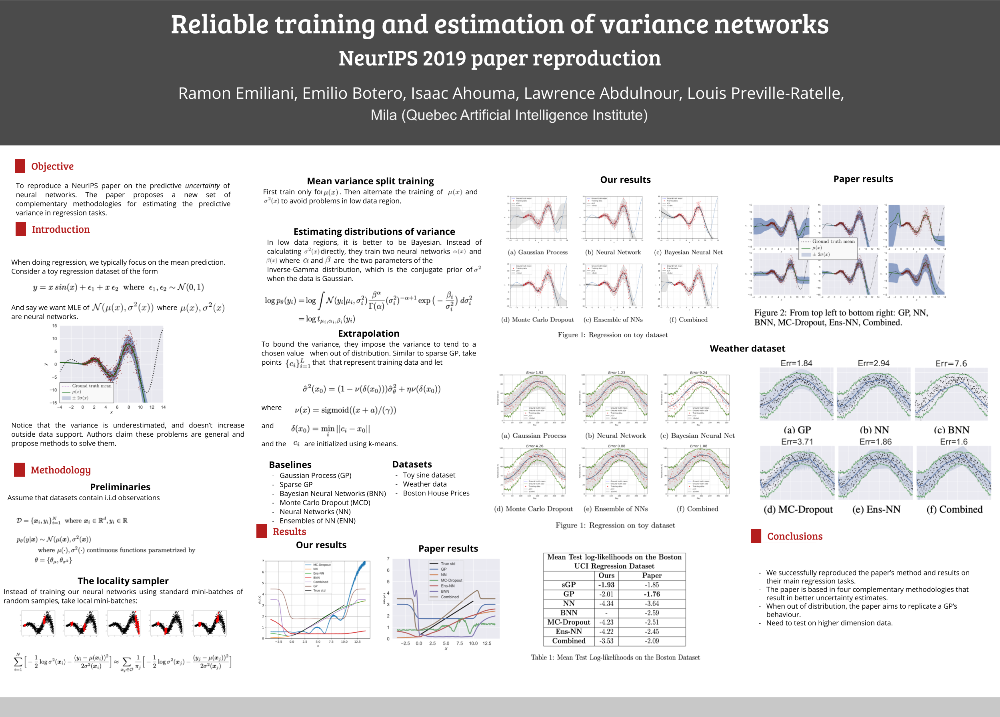

This is a Neurips 2019 reproducibility challenge project. In this project, my partners and I implemented the following paper 
  <https://papers.nips.cc/paper/8862-reliable-training-and-estimation-of-variance-networks.pdf> and reproduced its results.
  
 

The [project report](https://github.com/IsaacAhouma/IsaacAhouma.github.io/blob/master/files/Reliable_training_and_estimation_of_variance_networks_report.pdf) is also available.
